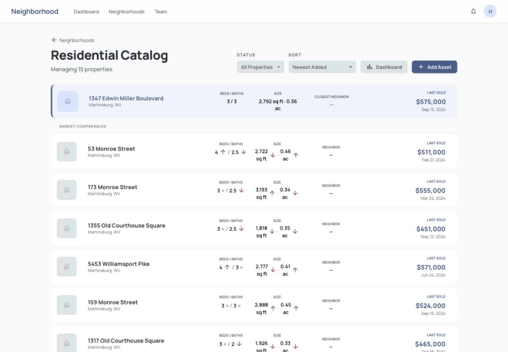
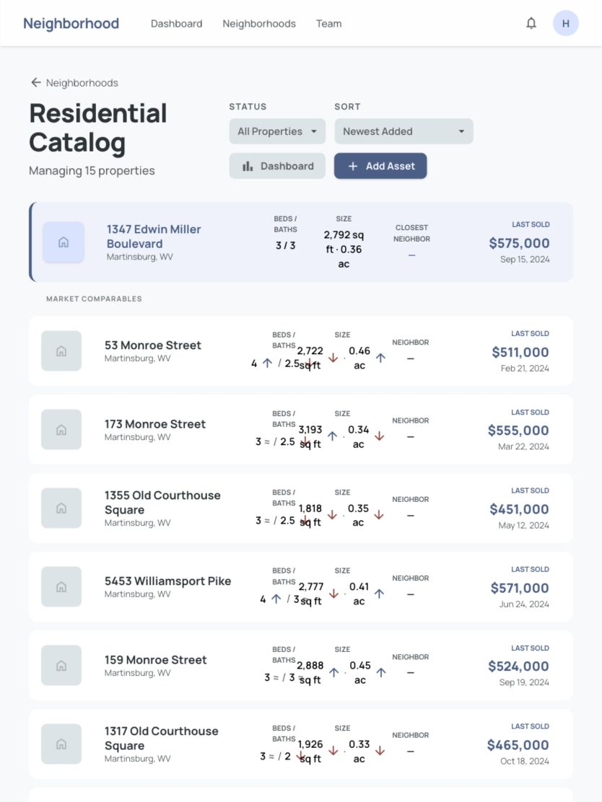
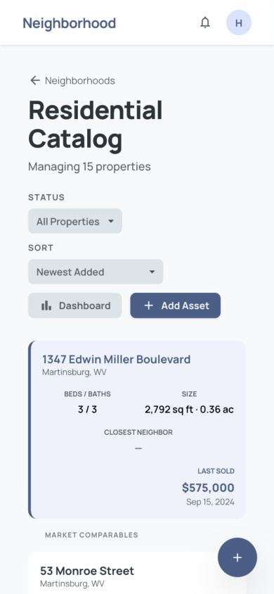
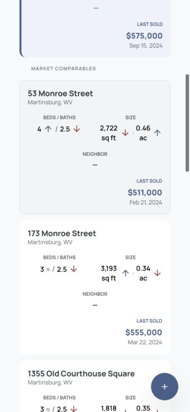
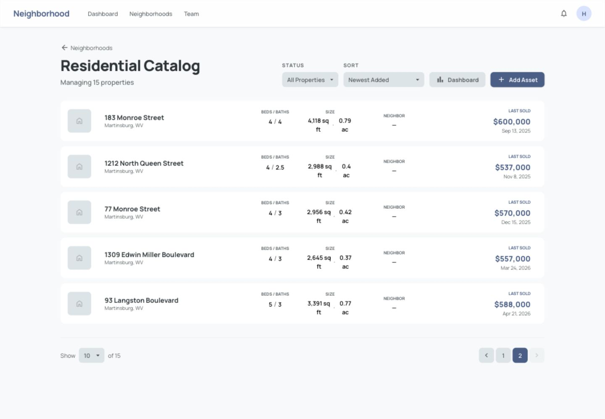

# Property Index UX/UI Handoff Brief

Date: August 11, 2026<br>
Screen reviewed: Neighborhood property index, 15 properties, one pinned target<br>
Primary job: Quickly compare a target property with neighborhood comparables, understand the price gap, and get a credible glimpse of why the gap exists.

## Start here

This folder is the shared workspace for the property-index redesign. Before designing, review these sources in order:

1. [`../../AGENTS.md`](../../AGENTS.md) — repository and implementation rules. These instructions are authoritative for any code changes.
2. [`../../DESIGN.md`](../../DESIGN.md) — the product design system and visual source of truth: “The Private Ledger,” soft minimalism, Manrope, tonal surfaces, limited borders, and the established color semantics.
3. [`../../resources/stubs/stitch-export/refined_property_catalog/screen.png`](../../resources/stubs/stitch-export/refined_property_catalog/screen.png) and [`code.html`](../../resources/stubs/stitch-export/refined_property_catalog/code.html) — the original property-catalog visual reference. Treat it as historical direction, not a requirement to preserve the current layout defects.
4. The screenshots in [`screenshots/`](screenshots/) — current live behavior captured at desktop, tablet, mobile, and page two.
5. The current implementation:
   - [`../../resources/js/views/properties/PropertyList.vue`](../../resources/js/views/properties/PropertyList.vue)
   - [`../../resources/js/components/properties/PropertyListItem.vue`](../../resources/js/components/properties/PropertyListItem.vue)
   - [`../../resources/js/components/properties/ComparisonIndicator.vue`](../../resources/js/components/properties/ComparisonIndicator.vue)

If your agent environment maintains its own feedback or memory, also inspect the relevant agent-specific files before revising work. This repository currently includes `.junie/memory/feedback.md`, `.junie/memory/errors.md`, and `.junie/memory/tasks.md`. Never treat secrets, credentials, generated dependencies, or unrelated repository files as design input.

## Where to put deliverables

Place all proposed design outputs under [`deliverables/`](deliverables/). Keep production source files unchanged until the user explicitly approves implementation.

Use this structure where applicable:

```text
design_handoff/property_index/deliverables/
├── README.md                 # Required: summary, rationale, assumptions, open questions
├── desktop.png              # Required: primary desktop state, ideally 1440 px wide
├── tablet.png               # Required: primary tablet state, ideally 834 px wide
├── mobile.png               # Required: primary mobile state, ideally 390 px wide
├── page-2-or-scrolled.png    # Required: proof the target baseline persists
├── interaction-notes.md     # Required: sorting, filtering, sticky behavior, focus and hover states
├── component-spec.md        # Recommended: spacing, type, tokens, responsive behavior
└── source/                   # Optional: editable design source or prototype assets
```

Do not overwrite the evidence in `screenshots/`. If you need to revise a deliverable, update the file in `deliverables/` and document the revision in `deliverables/README.md`.

## Where to look for feedback

- The user’s latest instructions and comments in the active Codex task take priority over this brief.
- Consolidate unresolved questions and requested decisions in `deliverables/README.md` under an **Open questions** heading.
- When feedback is given, record the response and resulting change under a dated **Revision notes** heading in `deliverables/README.md`.
- For implementation feedback, inspect `AGENTS.md` and current sibling Vue components before proposing new patterns.
- Agent-specific memory files may contain prior feedback, but they do not override the user, `AGENTS.md`, or `DESIGN.md`.

## Executive summary

The screen has a useful foundation: the target is pinned above the list, comparable rows share a consistent structure, and the core physical attributes are present. The design does not yet complete the comparison job. Prices are displayed without a delta from the target, attribute arrows show direction without magnitude, and the target disappears on page two. The tablet layout is visibly broken at 834 px, while the mobile layout is legible but inefficient and partially obscured by the floating action button.

The redesign should treat the target as a persistent baseline and make every comparable answer three questions in order:

1. How much more or less did it cost?
2. Is that difference still present after normalizing for square footage?
3. Which two or three property characteristics most plausibly explain the difference?

## Screenshot evidence

### Desktop — 1440 × 1000



The layout is visually calm and scans reasonably well, but it lacks explicit price comparison. Repeated micro-labels add noise, the target is not labeled as the target, and the empty Neighbor column consumes valuable space.

### Tablet — 834 × 1112



This is the highest-priority responsive defect. The desktop 12-column layout remains active, but the metric columns are too narrow. Beds, square footage, acreage, and comparison arrows collide and become difficult to associate with the correct value.

### Mobile overview — 390 × 844



Forty-pixel page gutters leave only about 310 px for content. The target card becomes very tall, both an Add Asset button and floating add button are shown, and the floating button overlaps the start of the comparable list.

### Mobile comparable rows — 390 × 844



The card layout is legible, but each row uses roughly a third of the viewport. Direction-only arrows still require mental arithmetic, the empty Neighbor section costs vertical space, and the floating action button covers card content.

### Desktop page two



The target and all comparison indicators disappear on page two. This breaks the primary task precisely when users inspect the remainder of the market.

## Prioritized findings

| Priority | Finding | Why it matters | Recommended response |
| --- | --- | --- | --- |
| P0 | Target baseline disappears after page one and can disappear under filtering. | Page-two properties cannot be compared to the target. | Return the target separately from paginated/filterable results and render a persistent compact target summary on every page. |
| P0 | Tablet columns overlap at 834 px. | Values become ambiguous and the screen looks broken. | Stop using the desktop 12-column row below roughly 1024 px. Use a two-line tablet row with address and price on line one, facts and deltas on line two. |
| P1 | Price has no target delta. | Users must subtract large numbers mentally and cannot rank gaps quickly. | Display signed absolute and percentage deltas beside every price, e.g. `−$64,000 · −11.1% vs target`. |
| P1 | Comparison arrows show direction but not magnitude. | Up or down does not explain why the price differs. | Replace or supplement arrows with signed values such as `+1 bed`, `−0.5 bath`, `−70 sq ft`, and `+0.10 ac`. |
| P1 | No normalized price measure is shown. | Larger houses naturally cost more, so raw price alone can mislead. | Add price per square foot and its delta from the target. The reviewed target is about `$206/sq ft`; the first comparable is about `$188/sq ft`. |
| P1 | Mobile actions and FAB compete. | The same add action appears twice and the FAB obscures results. | Keep one add action. Prefer the header action or a bottom action that respects safe-area and content padding. |
| P2 | Empty Neighbor data occupies a full column or section. | Every reviewed row shows `—`, wasting desktop width and mobile height. | Hide the field when unavailable across the result set or move it into optional expanded details. |
| P2 | Target status relies on tint and position. | The baseline is not explicit enough for rapid orientation or non-color perception. | Add a visible `Target property` label and repeat the baseline price, price per square foot, beds, baths, and size in a compact summary. |
| P2 | Default sort is Newest Added. | Record creation order is weakly related to comparative usefulness. | Default to `Most similar to target`, calculated primarily from beds, baths, square footage, acreage, and year built. |

## Recommended information hierarchy

### Persistent target summary

`TARGET PROPERTY`<br>
`1347 Edwin Miller Boulevard`<br>
`$575,000 · $206/sq ft · 3 bd · 3 ba · 2,792 sq ft · 0.36 ac`

Keep this visible above all pages and filters. A compact sticky version is appropriate after the user scrolls.

### Comparable row

1. Address and sale or listing status
2. Price and signed target delta
3. Price per square foot and signed target delta
4. Two or three strongest physical differences
5. Activity date as secondary metadata

Example:

> **53 Monroe Street**<br>
> **$511,000** · −$64,000 (−11.1%)<br>
> $188/sq ft · −$18/sq ft<br>
> Why it may differ: +1 bed · −0.5 bath · −70 sq ft · +0.10 ac<br>
> Sold Feb 21, 2024

Do not imply that more or less is inherently good. Use neutral delta styling; reserve success and error colors for actual positive or negative states.

## Responsive layout direction

### Desktop, 1024 px and above

- Use a table/card hybrid with shared column headings instead of repeating every micro-label.
- Give price, price delta, and price per square foot more prominence than Neighbor.
- Preserve approximately five to seven visible rows per viewport.

### Tablet, 768–1023 px

- Use a two-line row rather than compressing the desktop grid.
- Line one: address on the left; price and price delta on the right.
- Line two: beds, baths, square footage, acreage, and normalized price.
- Allow address wrapping without reducing metric columns below their content width.

### Mobile, below 768 px

- Reduce page gutters from 40 px to approximately 16–20 px.
- Put address and price or delta in the card header.
- Use a two-column fact grid below it.
- Show the top two explanatory deltas initially; place additional details behind progressive disclosure.
- Remove unavailable fields rather than rendering dash-only sections.
- Ensure the single add action never overlaps the list.

## Accessibility and interaction requirements

- Comparison meaning must be available as text, not color or icon direction alone.
- Add accessible names to previous and next pagination and icon-only add controls.
- Preserve a visible keyboard focus state across full-row links, filters, pagination, and actions.
- Ensure the complete row link has a concise accessible name; avoid forcing assistive technology to announce every metric as one long unstructured string.
- Maintain at least 44 × 44 px touch targets on mobile.

## Acceptance criteria

- The target and comparison deltas remain present across pagination, filtering, and sorting.
- No text or icon overlap at 320, 375, 390, 768, 834, 1024, and 1440 px widths.
- Every comparable shows raw price delta, percentage delta, and price-per-square-foot delta when data permits.
- Every comparable exposes two or three neutral, quantified physical differences from the target.
- Missing attributes do not reserve empty columns or card sections.
- Mobile presents only one add-property action and it never covers content.
- Sorting by similarity is available and understandable; the selected sort persists in the URL.
- Sale and listing prices are labeled consistently so unlike market events are not presented as directly equivalent without context.

## Implementation touchpoints

- `resources/js/views/properties/PropertyList.vue`
- `resources/js/components/properties/PropertyListItem.vue`
- `resources/js/components/properties/ComparisonIndicator.vue`
- `app/Http/Controllers/Api/V1/PropertyController.php`
- `app/Transformers/Api/V1/PropertyTransformer.php`

The UI agent should coordinate with the application agent on the persistent target payload, price-event semantics, normalized pricing, and similarity sort before finalizing visual states.
